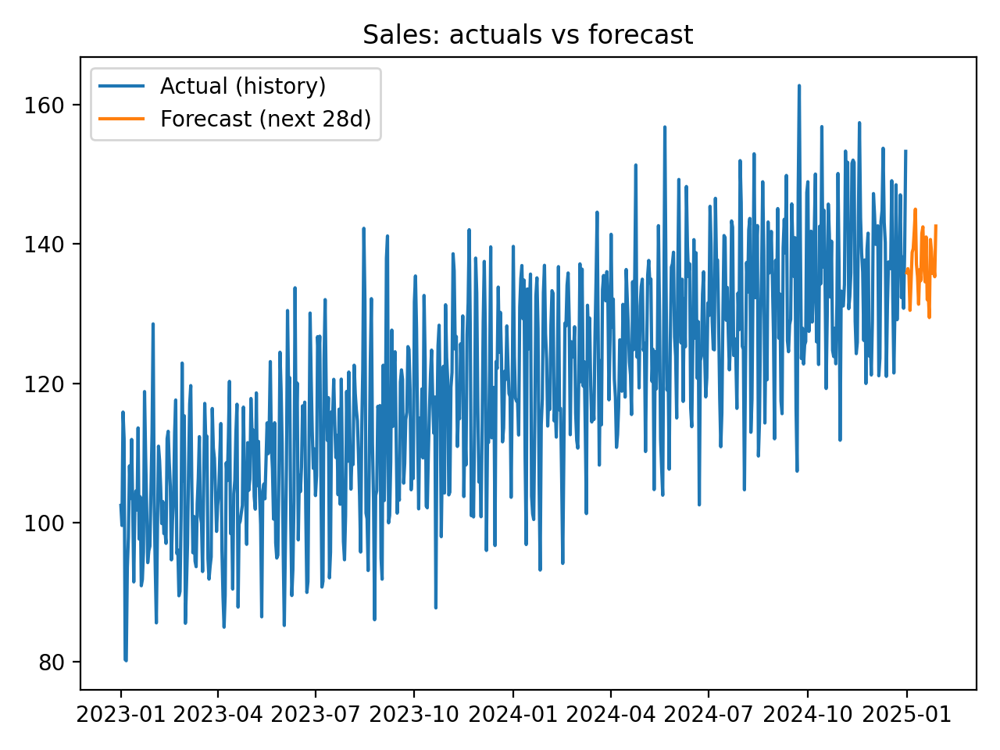

# Sales Forecast ML

Sales forecasting with Python. Includes rolling backtests, XGBoost and SARIMAX models, error metrics (MAE, MAPE, sMAPE), and automated 28‑day forecasts with plots. Demonstrates practical time‑series analysis and model evaluation for business use.

## Project Structure
```
sales-forecast-ml/
├─ data/
│  └─ raw.csv                # daily/weekly/monthly sales (date, sales)
├─ src/
│  ├─ backtest.py            # rolling-origin CV (horizon/lags)
│  └─ forecast.py            # fit/predict CLI for XGB
├─ README.md  
├─ reports/
│  └─ forecast_plot.png      # generated plot
├─ models/                   # saved models (.joblib)
├─ requirements.txt
└─ .gitignore
```

## Quickstart
### 1) Environment
```bash
# Using conda
conda create -n sales-forecast python=3.11 -y
conda activate sales-forecast
pip install -r requirements.txt
# If XGBoost complains about libomp on macOS:
conda install -c conda-forge libomp xgboost -y
```

### 2) Put data in place
Place your CSV at `data/raw.csv` with at least:
- `date`: parseable date
- `sales`: numeric

### 3) Backtest (evaluation)
```bash
python src/backtest.py --data data/raw.csv --freq D --horizon 14 --lags 28 --model xgb
# Or classical baseline:
python src/backtest.py --data data/raw.csv --freq D --horizon 14 --lags 28 --model sarimax
```

### 4) Train & Save
```bash
python src/forecast.py fit --data data/raw.csv --model xgb --out models/xgb.joblib
```

### 5) Forecast next 28 days
```bash
python src/forecast.py predict --model models/xgb.joblib --steps 28 --last_date 2024-12-31 --out forecasts.csv
```

### 6) Plot (optional)
```bash
python - <<'PY'
import pandas as pd, matplotlib.pyplot as plt
hist = pd.read_csv('data/raw.csv', parse_dates=['date']).sort_values('date')
fc   = pd.read_csv('forecasts.csv', parse_dates=['date']).sort_values('date')
plt.figure()
plt.plot(hist['date'], hist['sales'], label='Actual')
plt.plot(fc['date'], fc['forecast'], label='Forecast')
plt.legend(); plt.title('Sales (actuals vs forecast)'); plt.tight_layout()
plt.savefig('reports/forecast_plot.png', dpi=200)
print('Saved reports/forecast_plot.png')
PY
```

## Results

- **Evaluation**: Rolling backtests with a 14-day horizon and 28 lags produced an average error of **MAE ≈ 11.3**, meaning forecasts are off by about 11 sales units per day.  
- **Interpretation**: Given daily sales around ~100–150, this corresponds to roughly a **7–10% average error** (MAPE/sMAPE).  
- **Forecast**: The model generated a 28-day forecast beyond 2024-12-31, shown below. The forecast continues the observed upward trend while accounting for daily variability.  




## Notes
- **Horizon/Lags**: choose based on business cadence (e.g., horizon=14 days, lags=28 for daily).
- **Frequency**: `--freq D|W|M` for daily/weekly/monthly.
- **Metrics**: compare MAE/MAPE/sMAPE vs naïve baselines to prove value.
- **macOS libomp**: prefer conda (`libomp`, `xgboost`) if pip install causes runtime errors.

## License
See [LICENSE](LICENSE).
